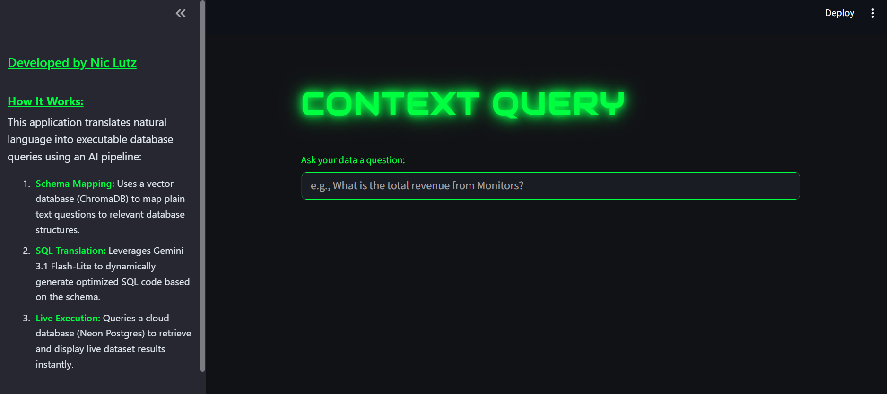
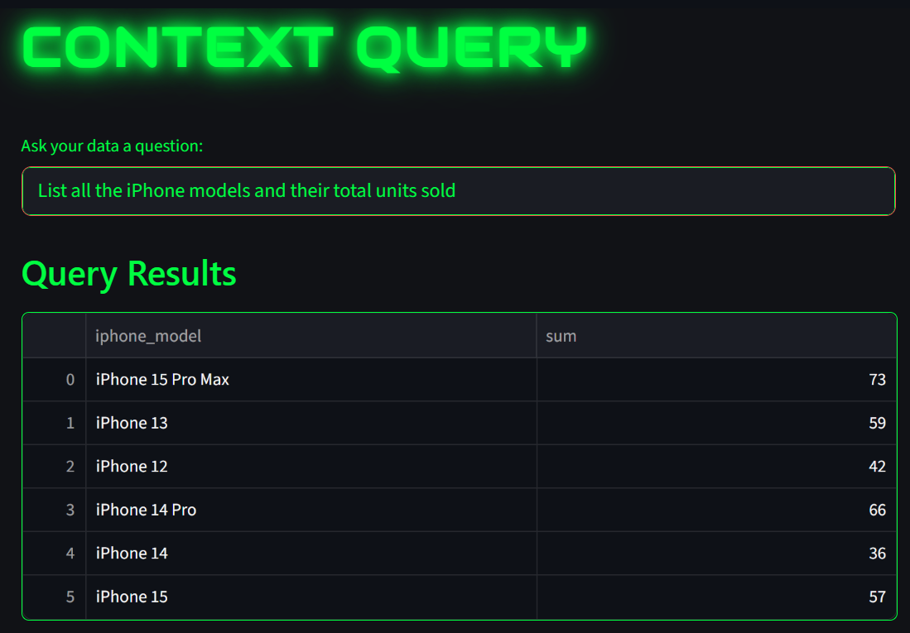
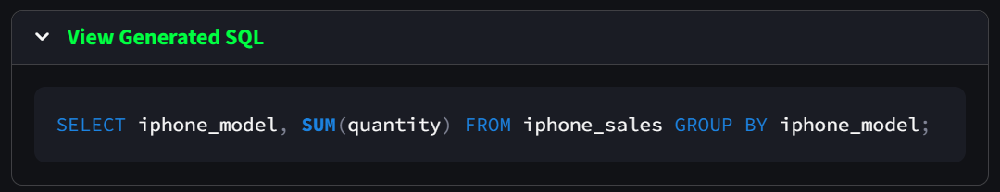
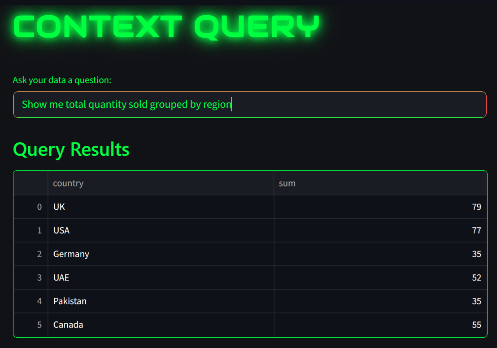
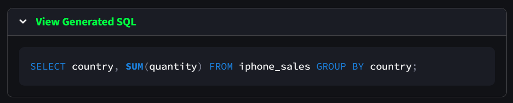

# ContextQuery
### *Moving from Manual Queries to AI-Driven Data Pipelines*

I built this project to bridge the gap between business intelligence and generative AI. Instead of forcing users to learn SQL or requesting manual updates from data teams, ContextQuery acts as an intelligent translator that lets anyone query live cloud databases using natural language.

---

## The Interface



**How to Use the Site:** Simply enter any plain-English business question into the interactive command terminal. The pipeline processes the natural language intent in real-time, queries the live dataset from the serverless cloud, and returns a clean data frame with an option to display the exact SQL query used to generate the result.

---

## Key Insights: What the Architecture Achieved
The ultimate goal was to prove that a Generative AI pipeline could handle real-world data dynamically without breaking or requiring hardcoded modifications for new data layouts.

* **Dynamic Schema Calibration:** By feeding the table's DDL structure directly into a localized **ChromaDB** vector store, the AI automatically learned the column definitions, formats, and text-case boundaries of new datasets without me altering a single line of application code.
* **Bypassing Library Guardrails:** When standard RAG wrappers threw parameter signature errors on text-heavy columns (like alphanumeric IDs), I wrote a custom database driver pipe using **psycopg2** and **Pandas** to safely bypass the middleman and stream clean data frames directly to the front end.
* **The Bottom Line:** This layout successfully decouples the visual interface from the storage layer. Whether querying a 4-row example or a real-world multi-column dataset, the pipeline dynamically translates text to accurate SQL in milliseconds.

---

## Methodology

### **Project Lifecycle**
* **Programmatic Data Ingestion:** Developed a clean ingestion pipeline that reads local dataset files, sanitizes column naming conventions to standard Postgres-friendly syntax, and handles data type conversion automatically.
* **Cloud Infrastructure Sync:** Programmatically connected to a remote, serverless **Neon Postgres** database cluster to provision data storage layers dynamically over secure network sockets.
* **Vector Textbook Training:** Vectorized the system schemas and table shapes locally to give the LLM core contextual awareness before firing off queries.

---

## Production Showcase

### **Test Case 1: Listing iPhone Models & Sales Volumes**
Translating basic business questions into real-time transactional summaries across a live product line.

#### User Interface Output:


#### Behind-the-Scenes Generated SQL:


---

### **Test Case 2: Multi-Row Regional Analysis**
Validating that the agent can intelligently handle text filtering, case sensitivity, and multi-row groupings cleanly.

#### User Interface Output:


#### Behind-the-Scenes Generated SQL:


---

## Technical Constraints & Future Horizons
Acknowledging the boundaries of the current architecture demonstrates product maturity and outlines clear optimization paths for production environments:

* **Free-Tier Boundaries:** Operating entirely on free cloud tiers introduces two clear production constraints. First, Neon Postgres compute instances automatically pause after periods of inactivity, causing a "cold start" latency delay on initial queries. Second, the Gemini 3.1 Flash-Lite API operates under strict free-tier token allocations and per-minute rate limits, bounding the volume of consecutive translations the pipeline can process without scaling to a paid enterprise tier.
* **Schema Scale Boundaries:** The vector lookup structure handles standalone transactional logging flawlessly. However, a massive enterprise data warehouse containing hundreds of heavily normalized tables would overwhelm a single prompt injection layer, requiring multi-agent routing filters to scale.
* **Security & Write Boundaries:** The pipeline is intentionally architected as a strict, read-only analytical extraction layer (`SELECT`). It excludes the routing permissions required for state-altering changes (`UPDATE`, `DELETE`), guaranteeing structural safety from conversational user inputs.

---

## The Logic: Pipeline Deep Dive
The core engine uses an object-oriented Python class structure that inherits database running capabilities and LLM chat interfaces simultaneously, pointing directly to the active model architecture.

```python
# Custom DBAPI2 connection string route inside app.py
class ContextQueryUI(PostgresRunner, ChromaDB_VectorStore, GoogleGeminiChat):
    def __init__(self, config=None, db_url=None):
        PostgresRunner.__init__(self, connection_string=db_url)
        ChromaDB_VectorStore.__init__(self, config=config)
        GoogleGeminiChat.__init__(self, config=config)
        self.model_id = 'gemini-3.1-flash-lite'

    def submit_prompt(self, prompt_list, **kwargs):
        genai.configure(api_key=os.getenv("GEMINI_API_KEY"))
        model = genai.GenerativeModel(self.model_id)
        full_prompt = "\n".join([m['content'] for m in prompt_list])
        full_prompt += "\nRespond ONLY with final SQL code. No markdown or explanations."
        response = model.generate_content(full_prompt)
        return response.text.replace('```sql', '').replace('```', '').strip()

    def run_sql(self, sql, context=None, **kwargs):
        import pandas as pd
        import psycopg2
        conn = psycopg2.connect(os.getenv("NEON_DATABASE_URL"))
        df = pd.read_sql_query(sql, conn)
        conn.close()
        return df
```

---

[← Back to Home](./index.html)
