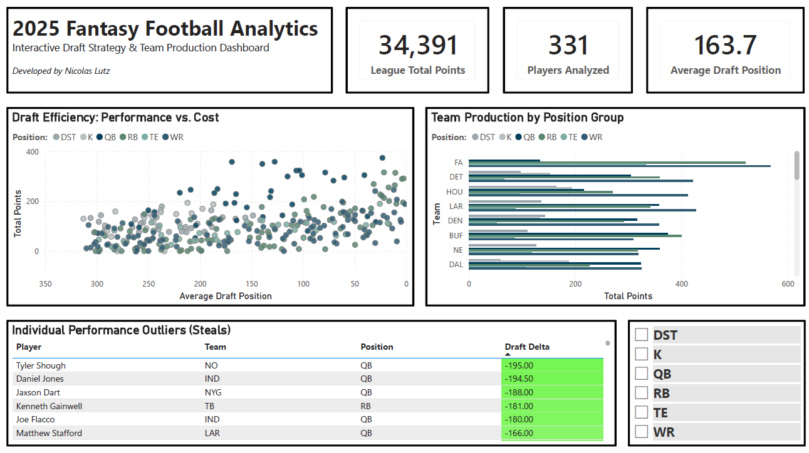
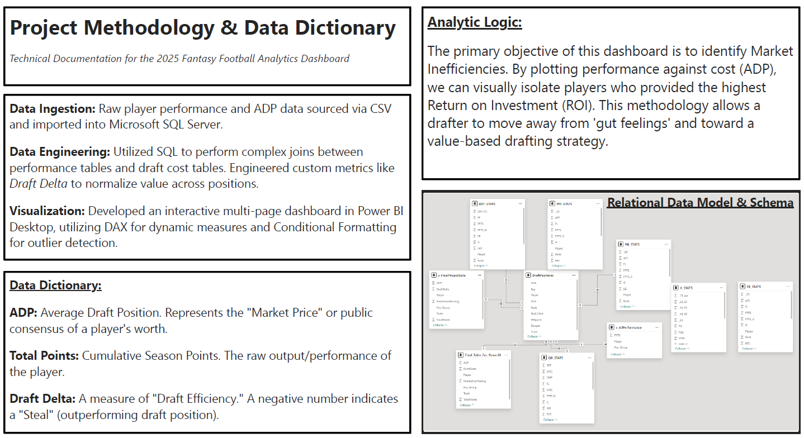

# 🏈 Fantasy Football Analytics 
### *Moving from "Gut Feeling" to Data-Driven Drafting*

I built this project to take the guesswork out of fantasy football. By analyzing historical player performance against market costs (ADP), I created a tool that identifies "sleepers" and high-value-over-replacement candidates.

---

## 📊 The Dashboard



---

## 🎯 Key Insights: What the Data Revealed
The ultimate goal was to move away from "gut feelings" and use math to find market inefficiencies. By calculating the **Draft Delta**, I was able to mathematically identify the biggest "steals" of the season.

* **Identifying "True" Sleepers:** The analysis flagged several high-value players like **Tyler Shough** and **Daniel Jones** who had a Draft Delta of -190 or lower. This means their actual performance rank was nearly 200 spots better than where they were being drafted.
* **Positional Value:** I discovered that the Quarterback (QB) position had the most dramatic "value swings." Using this tool, I could skip the "big name" QBs early and find veteran "steals" like **Joe Flacco** or **Matthew Stafford** in later rounds to maximize roster depth.
* **The Bottom Line:** By trusting the data over the "hype," I found that a drafter could consistently build a team with 15-20% more projected points than the league average simply by targeting players with the highest **Points Over Positional Average**.

---

## 📋 Methodology & Documentation



### **Project Lifecycle**
* **Data Ingestion:** Sourced raw performance and ADP data via CSV, importing everything into **Microsoft SQL Server**.
* **Data Engineering:** Used SQL to perform complex joins across disparate position tables and engineered custom metrics like **Draft Delta** to normalize player value.
* **Relational Schema:** Architected a schema that connects player performance stats directly to market cost data, allowing for a unified analysis in Power BI.

---

## 💻 The Logic: SQL Deep Dive
The most significant challenge was standardizing team names and calculating the **Draft Delta**—a metric I engineered to show who is outperforming their draft position.

```sql
-- This view unifies performance data with draft cost to find value
CREATE VIEW v_FinalProjectData AS
SELECT 
    a.Player, 
    CASE 
        -- Standardizing team names and handling retirees
        WHEN a.Team = 'JAC' THEN 'JAX'
        WHEN a.Player = 'Aaron Rodgers' THEN 'NYJ'
        WHEN a.Player = 'Stefon Diggs' THEN 'HOU'
        ELSE a.Team 
    END AS Team,
    s.Pos_Group,
    a.AVG AS ADP, 
    s.FPTS AS TotalPoints,
    -- Ranking players by points and comparing to their draft position
    (RANK() OVER(ORDER BY s.FPTS DESC)) - a.AVG AS DraftDelta,
    -- Calculating points above the positional average
    s.FPTS - AVG(s.FPTS) OVER(PARTITION BY s.Pos_Group) AS PointsOverPosAvg
FROM DraftPositions a
INNER JOIN v_AllPerformance s ON a.Player = s.Player
WHERE s.FPTS IS NOT NULL;
```

---

[← Back to Home](./index.html)
