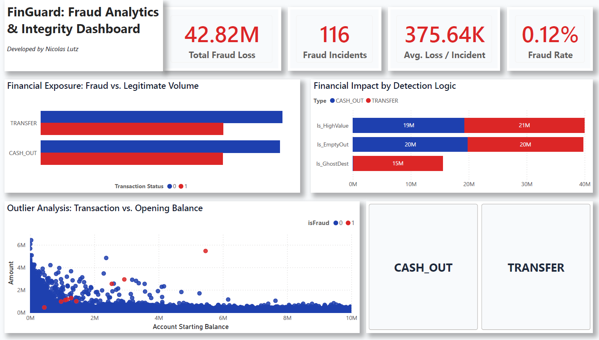
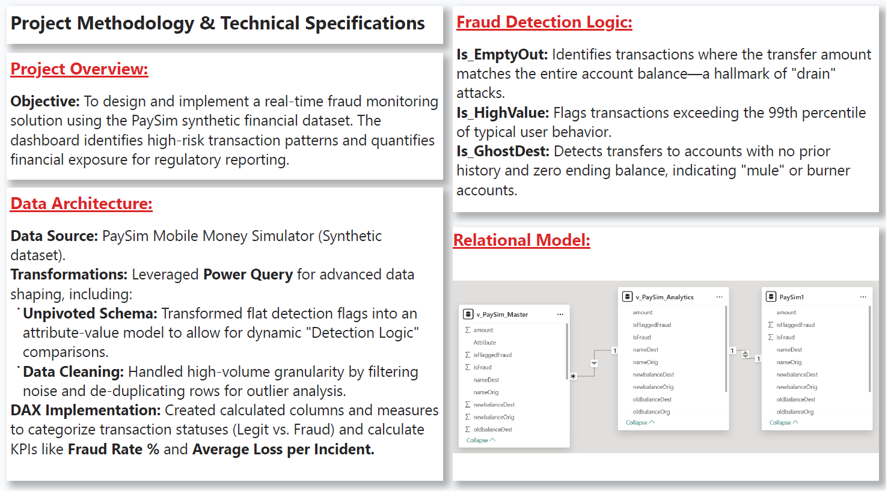

# 🛡️ FinGuard: Financial Fraud Analytics
### *Automating Oversight with Data-Driven Monitoring*

Manual investigative sampling is often too slow to catch sophisticated fraud. I built this project to transform raw transaction logs into an automated monitoring solution, specifically designed to catch "drain" attacks and burner account activities in real-time.

---

## 📊 The Dashboard


*An interactive monitoring solution featuring Outlier Analysis and "Detection Logic" performance breakdowns.*

---

## 🎯 Key Insights: What the Data Revealed
By moving away from manual sampling to full-scale data monitoring, the analysis uncovered several critical patterns:

* **High-Value Exposure:** Transactions exceeding the 99th percentile (Is_HighValue) accounted for nearly **$40M** in potential fraud loss, indicating that large-scale transfers are the primary risk vector.
* **"Drain" Attack Patterns:** The **Is_EmptyOut** logic identified a high concentration of fraud where account balances were wiped to zero in a single transaction—a hallmark of account takeover attacks.
* **Mule Account Detection:** By flagging transfers to accounts with no prior history and zero ending balances (Is_GhostDest), the tool successfully isolated "burner" accounts used to move stolen funds.
* **The ROI:** With a detected **Fraud Rate of 0.12%**, the system provides a benchmark for "normal" behavior, allowing investigators to focus 100% of their time on the high-risk outliers identified in the scatter plot.

---

## 📋 Methodology & Technical Specifications
A key technical challenge was handling the flat detection flags in the raw data without causing data inflation or losing row-level integrity.


*Technical documentation featuring the unpivoted data schema and the specific fraud detection logic used.*

### **The Lifecycle**
* **Data Architecture:** Leveraged **Power Query** to unpivot detection flags into an attribute-value model. This "Unpivoted Schema" allows for dynamic comparisons across different detection logics without duplicating data.
* **DAX Implementation:** Engineered custom measures to calculate KPIs like **Fraud Rate %** and **Average Loss per Incident**, ensuring that the financial impact is quantified for regulatory reporting.
* **Outlier Analysis:** Designed scatter plots to compare transaction amounts against opening balances, visually isolating the "Red" fraudulent transactions from legitimate user behavior.

---

## 💻 The Logic: DAX Detection Patterns
To drive the analytics on the dashboard, I engineered custom DAX measures. These allow for dynamic filtering—meaning when an investigator clicks on a specific "Detection Logic," these KPIs update instantly to show the specific risk associated with that pattern.

```dax
-- Calculates the average financial impact of a successful fraud incident
Avg Fraud Loss = 
CALCULATE(
    AVERAGE('v_PaySim_Master'[amount]), 
    'v_PaySim_Master'[isFraud] = 1
)

-- Calculates the percentage of total transactions flagged as fraudulent
Fraud Rate % = 
DIVIDE(
    CALCULATE(COUNT('v_PaySim_Master'[isFraud]), 'v_PaySim_Master'[isFraud] = 1),
    COUNT('v_PaySim_Master'[isFraud]),
    0
)

-- Categorizes binary flags into readable statuses for end-user reporting
Transaction Status = 
SWITCH(
    'v_PaySim_Master'[isFraud], 
    0, "Legit", 
    1, "Fraud", 
    "Unknown"
)
```

---

[← Back to Home](./index.html)
