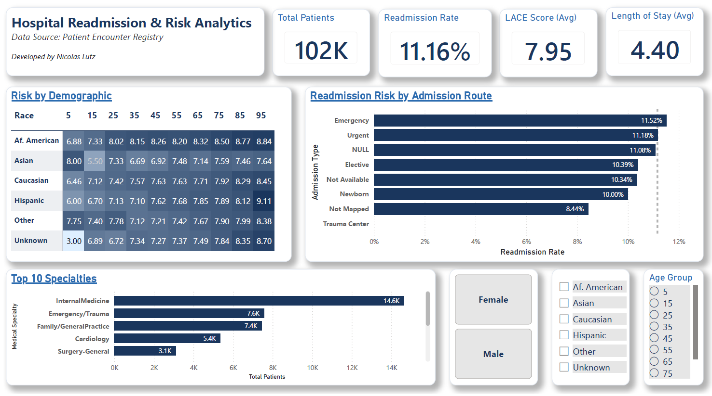
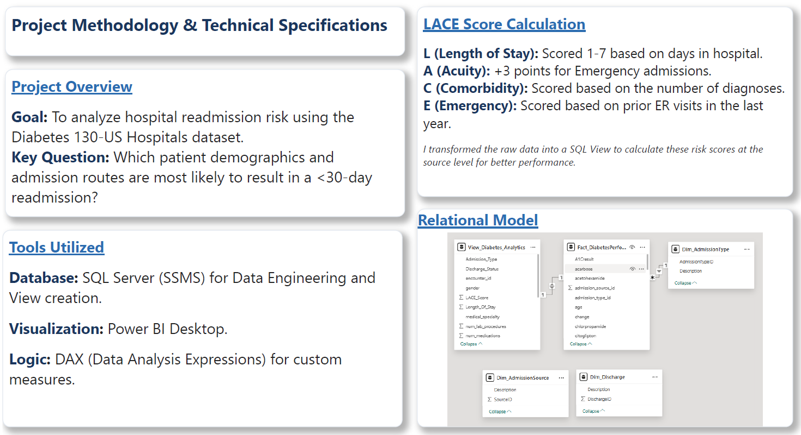

# 🏥 Hospital Readmission & Risk Analytics
### *Predicting Patient Risk Using Clinical Data & LACE Scoring*

High hospital readmission rates in diabetes patients are a multi-million dollar challenge for healthcare systems. I built this project to identify the clinical and demographic drivers behind these 30-day readmissions, providing a roadmap for hospital administrators to focus their resources.

---

## 📊 The Dashboard



---

## 🎯 Key Insights: What the Data Revealed

* **The "Emergency" Factor:** The data clearly showed that **Emergency admissions** have the highest readmission rate (~11.52%), significantly outperforming elective or newborn routes.
* **High-Volume Risk:** **Internal Medicine** is the highest-volume specialty but also carries a substantial risk profile. This suggests that resource allocation should be focused on post-discharge follow-ups specifically for Internal Med patients.
* **The LACE Benchmark:** With an average **LACE Score of 7.95**, the analysis provides a clear "Risk Baseline." Hospitals can now use this score to flag high-risk patients *before* they are discharged.

---

## 📋 Methodology & Technical Specifications



### **The Lifecycle**
* **Data Engineering:** Developed a custom SQL View in **SSMS** to calculate the LACE Score. This centralized the complex clinical logic at the source level.
* **Data Cleaning:** Utilized **Power Query** to standardize a dataset where nearly 40% of the specialty data was missing or "Unknown," ensuring the final analysis was based on clean, vetted data.
* **Relational Modeling:** Built a star-schema model in Power BI to connect patient encounters with clinical dimension tables for fast, interactive filtering.

---

## 💻 The Logic: SQL LACE Score
Instead of calculating the LACE risk score inside Power BI using DAX, I engineered it directly into a **SQL View**. This ensures "one source of truth" for the clinical logic and keeps the dashboard performance snappy by handling the heavy math at the database level.

```sql
-- This view centralizes clinical risk logic and standardizes patient demographics
CREATE VIEW View_Diabetes_Analytics AS
SELECT 
    f.encounter_id,
    f.patient_nbr,
    f.medical_specialty, 
    
    -- Normalizing age ranges into numeric midpoints for trend analysis
    CASE 
        WHEN age = '[0-10)' THEN 5   WHEN age = '[10-20)' THEN 15
        WHEN age = '[20-30)' THEN 25  WHEN age = '[30-40)' THEN 35
        WHEN age = '[40-50)' THEN 45  WHEN age = '[50-60)' THEN 55
        WHEN age = '[60-70)' THEN 65  WHEN age = '[70-80)' THEN 75
        WHEN age = '[80-90)' THEN 85  WHEN age = '[90-100)' THEN 95
        ELSE NULL END AS Patient_Age_Numeric,
    
    -- THE LACE SCORE: A clinical metric for readmission risk
    -- L (Length of Stay) + A (Acuity) + C (Comorbidities) + E (Emergency)
    (CASE 
        WHEN f.time_in_hospital >= 14 THEN 7 
        WHEN f.time_in_hospital BETWEEN 7 AND 13 THEN 5 
        WHEN f.time_in_hospital BETWEEN 4 AND 6 THEN 4 
        ELSE f.time_in_hospital END +
     CASE WHEN adm.Description = 'Emergency' THEN 3 ELSE 0 END +
     CASE WHEN f.number_diagnoses >= 3 THEN 3 ELSE f.number_diagnoses END +
     CASE WHEN f.number_emergency >= 4 THEN 4 ELSE f.number_emergency END) AS LACE_Score,

    -- Creating a binary flag for 30-day readmissions
    CASE WHEN readmitted = '<30' THEN 1 ELSE 0 END AS Readmitted_30_Days

FROM Fact_DiabetesPerformance f
LEFT JOIN Dim_AdmissionType adm ON f.admission_type_id = adm.AdmissionTypeID
LEFT JOIN Dim_Discharge dis ON f.discharge_disposition_id = dis.DischargeID;
```

---


[← Back to Home](./index.html)
