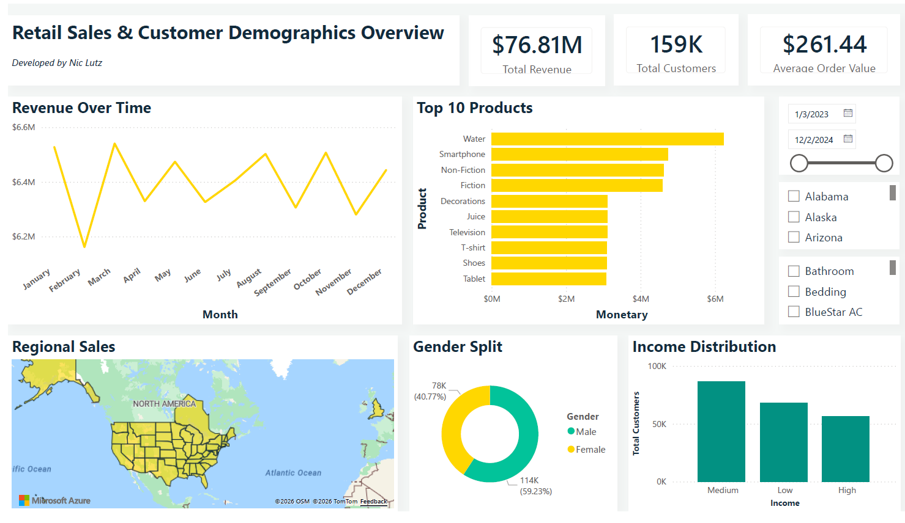
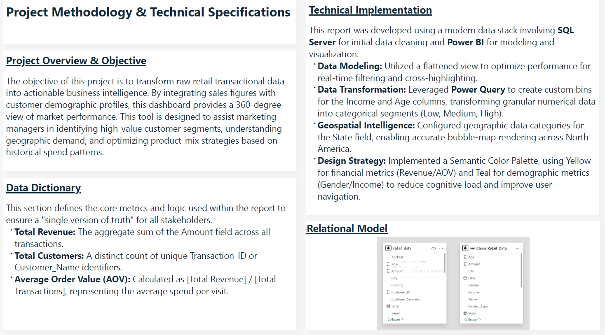

# Retail Sales & Customer Demographics
### *Transforming Fragmented Logs into Market Intelligence*

Retailers often sit on mountains of transactional data without knowing who their best customers actually are. I built this 360-degree view to bridge that gap, converting raw logs into a dynamic environment that identifies high-value segments and regional demand.

---

## The Dashboard



---

## Key Insights: What the Data Revealed

* **The High-Value Persona:** The data reveals that the **"Medium" income bracket** is the primary driver of volume, outperforming both the Low and High brackets in total customer count.
* **Spending Power:** Despite the volume in the Medium bracket, the **Average Order Value (AOV) stands strong at $261.44**, providing a clear benchmark for upselling strategies.
* **Gender Dynamics:** With a **59.23% Male** customer base, there is a significant opportunity to either lean into this dominant segment or design targeted outreach to increase the Female market share.
* **Product Performance:** "Water" and "Smartphones" emerged as the top-tier revenue drivers, suggesting that these "anchor" products are what draw customers into the ecosystem.

---

## Methodology & Design Strategy



### **The Lifecycle**
* **Data Cleansing:** Used **SQL** to flatten disparate tables into a single view, ensuring referential integrity before the data ever touched the visualization layer.
* **Feature Engineering:** Leveraged **Power Query** to transform granular numerical data into categorical bins (Low, Medium, High). This turned "raw noise" into "executive-ready" segments.
* **Geospatial Intelligence:** Configured geographic data categories to enable accurate bubble-map rendering, allowing managers to see regional demand across North America at a glance.

---

## The Logic: Advanced DAX Patterns
To go beyond simple totals, I authored complex measures to track **Recency** and **Frequency**, which are the building blocks of RFM (Recency, Frequency, Monetary) analysis.

```dax
-- Calculates the number of days since a customer's last purchase
Recency = 
VAR LastCustomerPurchase = MAX(vw_Clean_Retail_Data[Date])
VAR LastDataUpdate = MAXX(ALL(vw_Clean_Retail_Data), vw_Clean_Retail_Data[Date])
RETURN 
DATEDIFF(LastCustomerPurchase, LastDataUpdate, DAY)

-- Determines the Average Order Value by dividing Revenue by Transaction Frequency
Average Order Value = DIVIDE([Monetary], [Frequency], 0)
```

---

[← Back to Home](./index.html)
